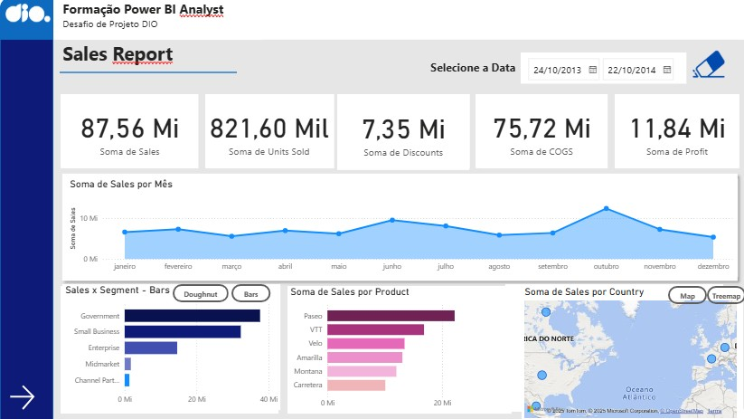
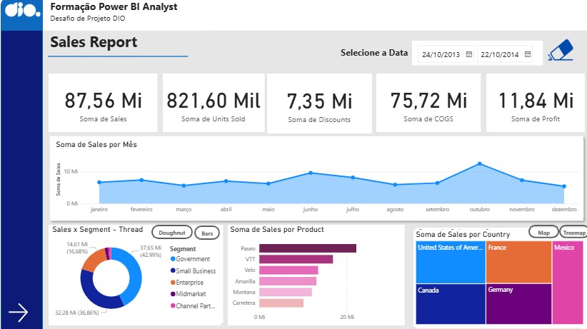
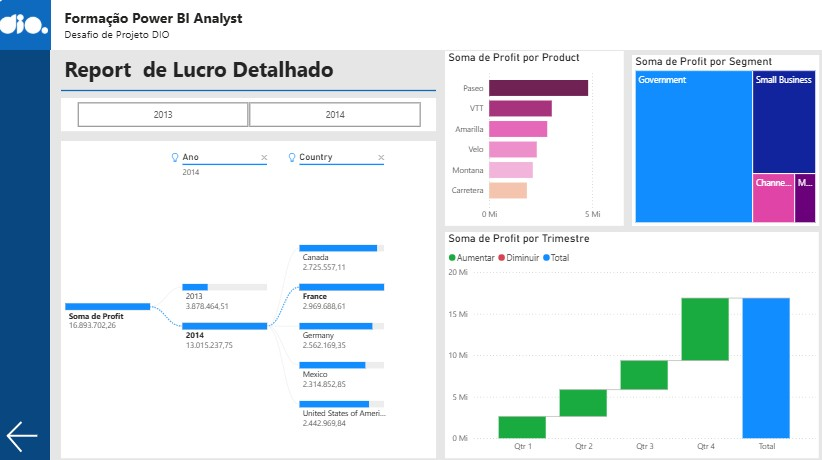

# 📊 Desafio de Projeto: Criando um Relatório Gerencial de Vendas com Power BI

Este repositório contém o desafio de projeto “Criando Um Relatório Gerencial de Vendas com Power BI” realizado no curso Power BI Data Analyst da Digital Innovation One (DIO).O relatório foi construído utilizando o dataset Financial Sample, disponibilizado no próprio Power BI.

# 🎯 Objetivo do Projeto

O desafio consistiu em desenvolver um relatório gerencial de vendas com foco em navegabilidade e experiência do usuário. Para isso, foram aplicados recursos de:

- Indicadores para alternar entre visuais em uma mesma página;

- Botões para facilitar a navegação entre páginas;

- Botão de limpeza de filtros, garantindo maior autonomia ao usuário.

#
## 📁 Arquivos

* **Dataset usado:** [Amostra Financeira (Excel)](Arquivos/Financial%20Sample.xlsx)
* **Arquivo do Dashboard:** [Dashboard Power BI (PBIX)](Arquivos/dashboard_datasetsample_pbi.pbix)
* **Imagens usadas:** [Dashboard Power BI (PBIX)](Arquivos/dashboard_datasetsample_pbi.pbix)

---

## 📝 Estrutura do Relatório  

### 🖼️ Página 1 – Sales Report (Visão Geral)

Nesta página, o usuário tem uma visão consolidada das principais métricas:

- Sales (87,56 Mi)

- Units Sold (821,60 Mil)

- Discounts (7,35 Mi)

- COGS (75,72 Mi)

- Profit (11,84 Mi)

Além disso, a página apresenta:

- Evolução mensal das vendas (linha do tempo);

- Segmentação de vendas por Segmento (Gráfico de Pizza e Barras, alternados via indicadores);

- Ranking de produtos mais vendidos;

- Vendas por país (Treemap e Mapa, alternados via indicadores).

📌 Insights:

Outubro foi o mês de maior volume de vendas.

- O segmento Government lidera nas vendas totais.

- Produtos da linha Paseo e VTT são os mais representativos.

- Estados Unidos concentram a maior parte das vendas.

### Página 1  
 

## 🖼️ Página 1.2 – Sales Report (Visão Alternativa com Indicadores)

Esta página demonstra o uso prático dos indicadores, que permitem ao usuário alternar entre diferentes visuais para analisar os mesmos dados. A alternância entre gráficos facilita a comparação entre segmentos, enquanto os botões de navegação tornam a exploração mais intuitiva e dinâmica.

### Página 1.2 
 

### 🖼️ Página 2 – Report de Lucro Detalhado

Aqui o foco está no detalhamento dos lucros:

- Lucro por Ano e País (2013 e 2014).

- Lucro por Produto (com destaque para Paseo e VTT).

- Lucro por Segmento, em formato de treemap.

- Lucro por Trimestre, com visual de cascata para mostrar aumentos e reduções.

📌 Insights:

- O ano de 2014 apresentou crescimento expressivo nos lucros em comparação a 2013.

- O segmento Government foi o mais lucrativo.

- Paseo é o produto com maior contribuição de lucro.

### Página 2
 

---

## 🚀 Conclusão

Este projeto foi fundamental para consolidar meus conhecimentos em Power BI, especialmente no uso de recursos de navegabilidade e experiência do usuário.
A aplicação de indicadores, botões e visuais interativos tornou o relatório mais intuitivo, dinâmico e funcional, proporcionando ao usuário final uma exploração mais eficiente dos dados.

---

## 🔗 Conecte-se comigo  
📌 [LinkedIn - Ariadina Nascimento](https://www.linkedin.com/in/ariadinaanascimento)  

---
